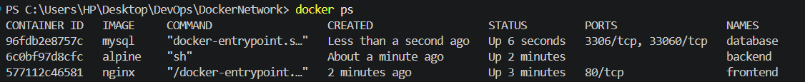
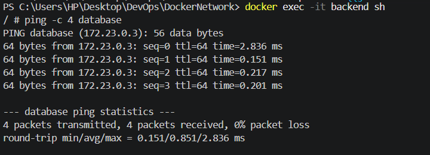
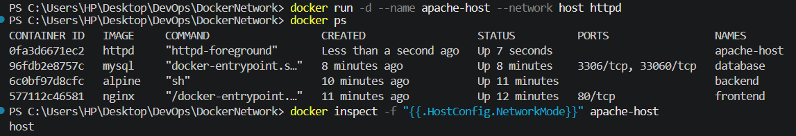
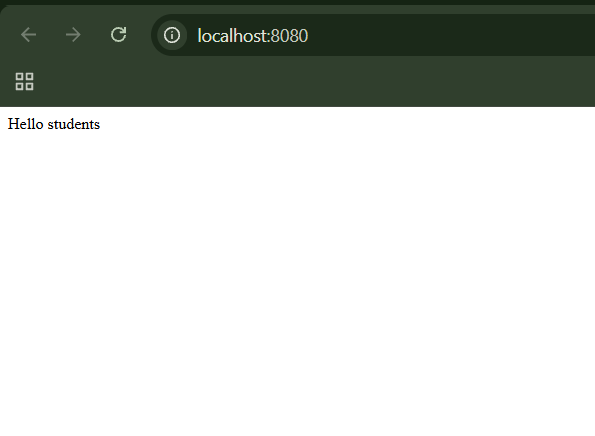
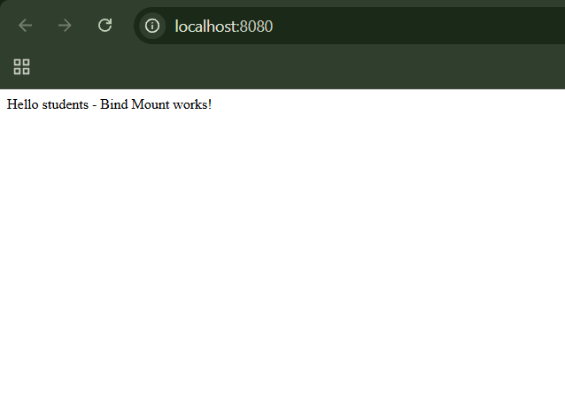

# Docker Networking & Volume Homework

This demonstrates Docker container networking, host networking, bind mounts, and overlay networks.
---

## Task 1: Docker Container Networking

### Objective

Create Frontend, Backend, and Database containers using three Docker networks, with Backend connected to two networks.

### Networks Created

```bash
docker network create frontend-net
docker network create backend-net
docker network create db-net
```

### Containers

**Frontend — Nginx**

```bash
docker run -d --name frontend --network frontend-net nginx
```

**Backend — Alpine**

```bash
docker run -dit --name backend --network frontend-net alpine sh
docker network connect db-net backend
```

**Database — MySQL**

```bash
docker run -d --name database --network db-net -e MYSQL_ROOT_PASSWORD=root mysql
```

### Network Configuration

```text
frontend-net:
  Frontend ↔ Backend

db-net:
  Backend ↔ Database

backend-net:
  Created but not attached
```

Backend is connected to both `frontend-net` and `db-net`.

### Connectivity Tests

Backend → Database:

```bash
docker exec -it backend sh
ping -c 4 database
```

Result: **4 packets received, 0% packet loss.**

Frontend → Backend was verified using Docker's internal DNS:

```bash
docker exec frontend getent hosts backend
```

Frontend → Database was isolated because the containers do not share a network.

### Screenshots




## Task 2: Host Network

### Objective

Run an Apache HTTP Server container using the host network and access it through port 80.

### Apache Image

```bash
docker pull httpd
```

### Host Network Container

```bash
docker run -d --name apache-host --network host httpd
```

Network mode was verified with:

```bash
docker inspect -f "{{.HostConfig.NetworkMode}}" apache-host
```

Result:

```text
host
```

Apache configuration was verified with:

```bash
docker exec apache-host httpd -t
```

Result:

```text
Syntax OK
```

Apache was successfully accessed on port 80 using:

```bash
docker run --rm --network host curlimages/curl:latest http://localhost:80
```

The response displayed:

```text
It works! Apache httpd
```

### Screenshot


---

## Task 3: Bind Mount

### Objective

Mount a local directory into an Nginx container and verify that file changes are reflected without restarting the container.

### Local File

Created:

```text
bind-mount/
└── index.html
```

Initial content:

```text
Hello students
```

### Nginx Container

```bash
docker run -d --name nginx-bind -p 8080:80 -v "${PWD}\bind-mount:/usr/share/nginx/html" nginx
```

The local `bind-mount` directory was mounted to Nginx's web directory:

```text
Local:     bind-mount/
Container: /usr/share/nginx/html
```

The page was accessed at:

```text
http://localhost:8080
```

and initially displayed:

```text
Hello students
```

The local `index.html` was then modified to:

```text
Hello students - Bind Mount works!
```

After refreshing the browser **without restarting the container**, the updated content appeared.

### Screenshots




---

## Task 4: Overlay Network

### What is an Overlay Network?

A Docker overlay network allows containers or services running on **different Docker hosts** to communicate through a shared logical network.

Unlike a bridge network, which normally operates within a single Docker host, an overlay network enables **multi-host container communication**.

### Use Cases

* Docker Swarm and distributed applications
* Communication between services running on different hosts
* Multi-host microservice deployments

### Bridge vs Overlay

| Feature                 | Bridge           | Overlay              |
| ----------------------- | ---------------- | -------------------- |
| Scope                   | Single host      | Multiple hosts       |
| Container communication | Same host        | Across hosts         |
| Common use              | Local containers | Distributed services |

---