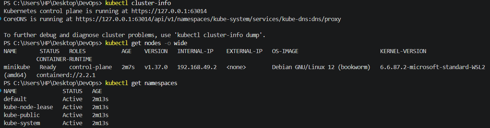
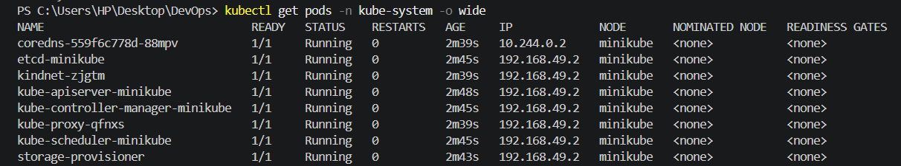
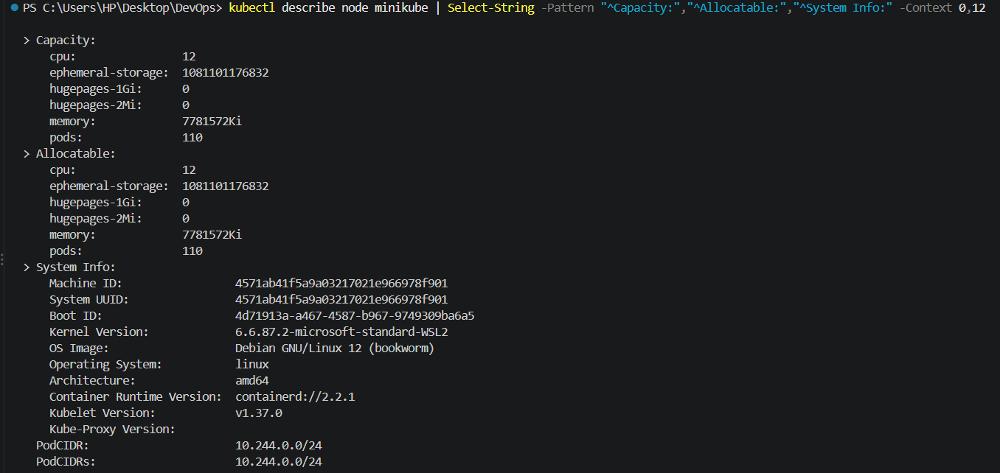
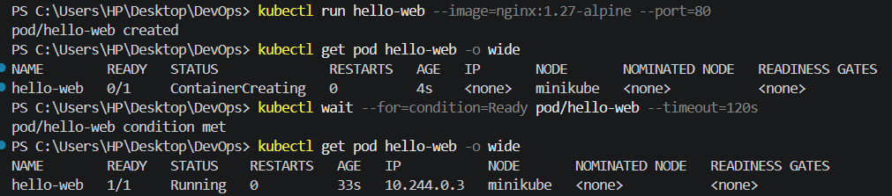
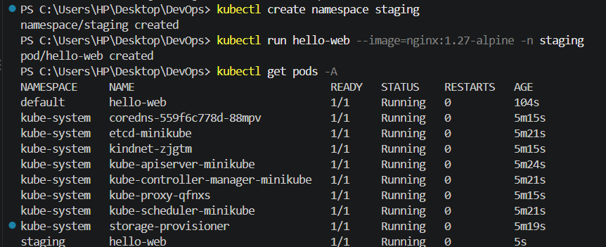
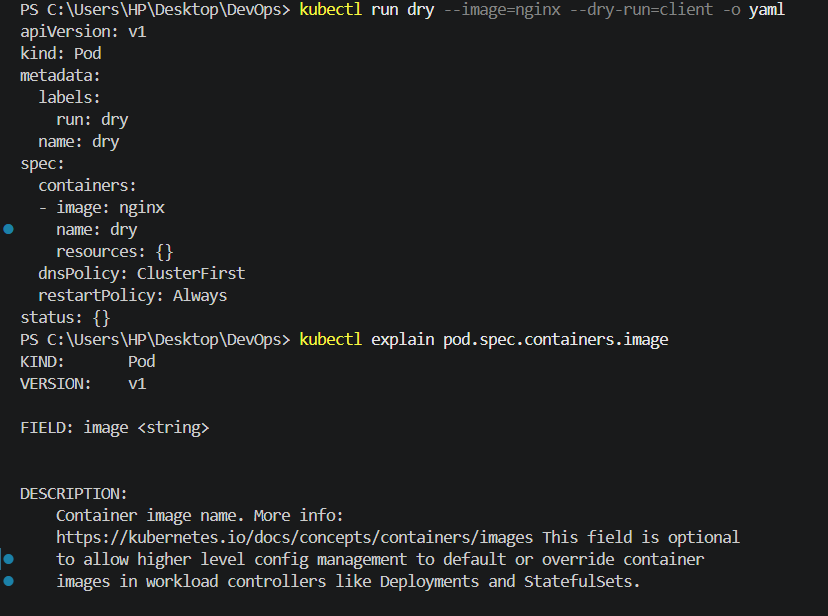

# Kubernetes Fundamentals

## Environment

| Tool       | Version |
| ---------- | ------- |
| Docker     | 29.1.5  |
| Minikube   | 1.39.0  |
| Kubernetes | v1.37.0 |
| kubectl    | v1.34.1 |
| Driver     | Docker  |

## 1. Start Minikube

```powershell
minikube start --driver=docker --kubernetes-version=v1.37.0 --base-image=gcr.io/k8s-minikube/kicbase:v0.0.49
```

Verify the cluster:

```powershell
kubectl cluster-info
kubectl get nodes -o wide
kubectl get namespaces
```

**Screenshot:** 



---

## 2. Kubernetes System Components

Check the system Pods:

```powershell
kubectl get pods -n kube-system -o wide
```

| Component               | Purpose                                 |
| ----------------------- | --------------------------------------- |
| kube-apiserver          | Entry point for Kubernetes API requests |
| etcd                    | Stores cluster state                    |
| kube-scheduler          | Assigns Pods to nodes                   |
| kube-controller-manager | Maintains desired cluster state         |
| kubelet                 | Manages Pods on the node                |
| kube-proxy              | Handles Service networking              |
| CoreDNS                 | Provides cluster DNS                    |
| containerd              | Container runtime                       |

**Screenshot:** 



---

## 3. Node Details

```powershell
kubectl describe node minikube
```

The node provides information about CPU, memory, storage, Pod capacity, operating system, container runtime, and node conditions.

**Screenshot:** 


---

## 4. Create the First Pod

Create an Nginx Pod:

```powershell
kubectl run hello-web --image=nginx:1.27-alpine --port=80
kubectl wait --for=condition=Ready pod/hello-web --timeout=120s
kubectl get pod hello-web -o wide
```

Verify the Nginx version and logs:

```powershell
kubectl exec hello-web -- nginx -v
kubectl logs hello-web
```

**Screenshot:** 



---

## 5. Namespaces

Create a `staging` namespace and run another Pod with the same name:

```powershell
kubectl create namespace staging
kubectl run hello-web --image=nginx:1.27-alpine -n staging
kubectl get pods -A
```

This demonstrates that the same resource name can exist in different namespaces.

**Screenshot:** 



---

## 6. Explore Kubernetes Commands

Generate a Pod manifest without creating the Pod:

```powershell
kubectl run dry --image=nginx --dry-run=client -o yaml
```

View documentation for the container image field:

```powershell
kubectl explain pod.spec.containers.image
```

**Screenshot:**


---

## 7. Cleanup

Delete the Pods and namespace:

```powershell
kubectl delete pod hello-web
kubectl delete namespace staging
```

Verify:

```powershell
kubectl get pods -A
```

---

## Result

Successfully created and verified a local single-node Kubernetes cluster using Minikube and Docker, explored Kubernetes system components and node resources, deployed Pods, worked with namespaces, inspected Pod configuration, and cleaned up the resources.
