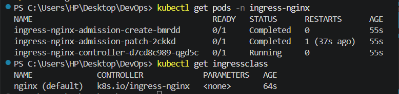
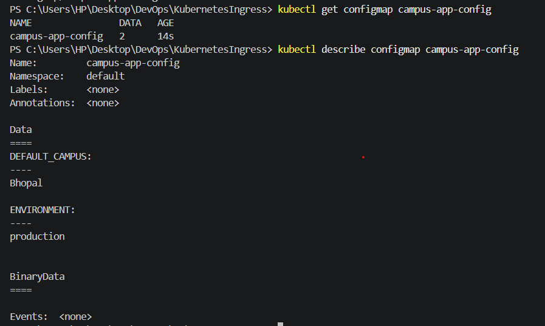
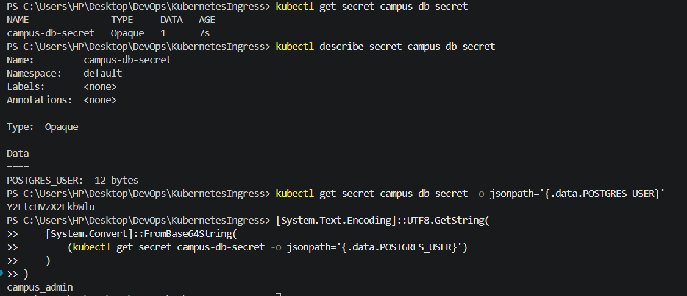
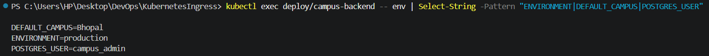
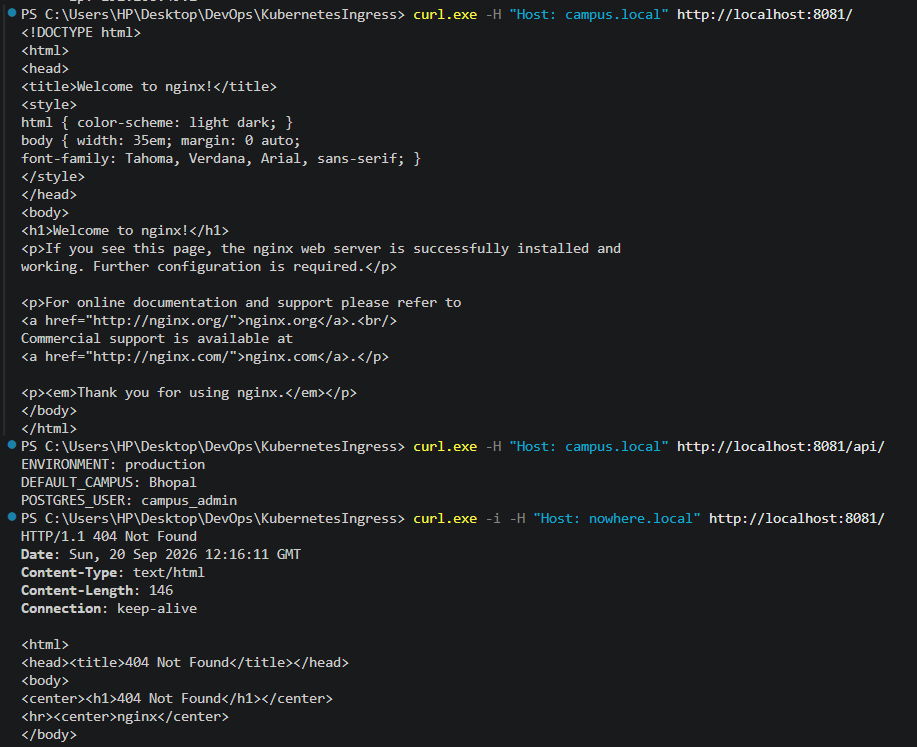

# Kubernetes Ingress, ConfigMaps and Secrets

## Objective

Deploy a simple campus application on Kubernetes using:

* **ConfigMap** for non-sensitive application configuration
* **Secret** for sensitive database credentials
* **Ingress** for HTTP host/path-based routing
* **NGINX Ingress Controller** as the entry point

## Environment

| Component          | Version    |
| ------------------ | ---------- |
| Kubernetes         | v1.37.0    |
| Minikube           | v1.39.0    |
| Driver             | Docker     |
| Ingress Controller | NGINX      |
| OS                 | Windows 11 |


## 1. Enable Ingress Controller

```powershell
minikube addons enable ingress
kubectl get pods -n ingress-nginx
kubectl get ingressclass
```

The NGINX Ingress Controller was enabled and the `nginx` IngressClass was available.



## 2. ConfigMap

`configmap.yaml` stores non-sensitive application configuration:

```text
ENVIRONMENT=production
DEFAULT_CAMPUS=Bhopal
```

Applied and verified using:

```powershell
kubectl apply -f .\manifests\configmap.yaml
kubectl get configmap campus-app-config
kubectl describe configmap campus-app-config
```



## 3. Secret

`secret.yaml` stores the database username:

```text
POSTGRES_USER=campus_admin
```

The value is stored by Kubernetes in Base64-encoded form.

```powershell
kubectl apply -f .\manifests\secret.yaml
kubectl get secret campus-db-secret
kubectl describe secret campus-db-secret
kubectl get secret campus-db-secret -o jsonpath='{.data.POSTGRES_USER}'
```

The encoded value was decoded to verify:

```text
campus_admin
```



## 4. Frontend and Backend

The frontend and backend Deployments each run **2 replicas**.

Both applications are exposed through internal `ClusterIP` Services.

The backend receives:

* ConfigMap values through `envFrom`
* `POSTGRES_USER` through `secretKeyRef`

Deployment verification:

```powershell
kubectl get deployments
kubectl get pods,svc
kubectl rollout status deployment/campus-frontend --timeout=300s
kubectl rollout status deployment/campus-backend --timeout=300s
```

Environment verification:

```powershell
kubectl exec deploy/campus-backend -- env | Select-String -Pattern "ENVIRONMENT|DEFAULT_CAMPUS|POSTGRES_USER"
```

Output confirmed:

```text
DEFAULT_CAMPUS=Bhopal
ENVIRONMENT=production
POSTGRES_USER=campus_admin
```



## 5. Ingress Routing

The Ingress uses the host:

```text
campus.local
```

Routing:

```text
campus.local/       → campus-frontend-service:80
campus.local/api/   → campus-backend-service:8000
```

The `/api` path is rewritten before reaching the backend.

Ingress verification:

```powershell
kubectl apply -f .\manifests\ingress.yaml
kubectl get ingress campus-ingress
kubectl describe ingress campus-ingress
```

The Ingress Controller was accessed using:

```powershell
kubectl port-forward -n ingress-nginx svc/ingress-nginx-controller 8081:80
```

Routing tests:

```powershell
curl.exe -H "Host: campus.local" http://localhost:8081/
curl.exe -H "Host: campus.local" http://localhost:8081/api/
curl.exe -i -H "Host: nowhere.local" http://localhost:8081/
```

Results:

* `/` returned the NGINX frontend page.
* `/api/` returned backend configuration and Secret values.
* An unknown host returned `404 Not Found`.



## Architecture

```text
                         campus.local
                              |
                              v
                  NGINX Ingress Controller
                       /            \
                      /              \
                     v                v
          Frontend Service      Backend Service
             ClusterIP              ClusterIP
                |                       |
          2 × Nginx Pods          2 × Python Pods
                                        |
                              +---------+---------+
                              |                   |
                         ConfigMap             Secret
                       campus-app-config     campus-db-secret
```

## Result

Successfully deployed and verified Kubernetes ConfigMaps, Secrets, Deployments, Services, and NGINX Ingress routing with host and path-based rules.
