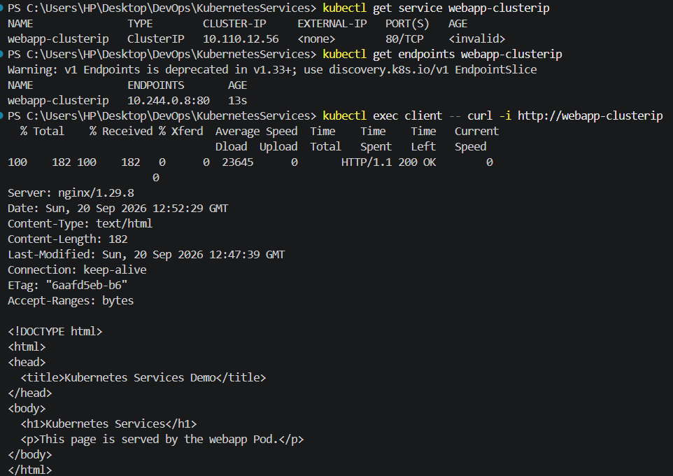

# ClusterIP Service

## Objective

Create a ClusterIP Service to provide stable internal access to the `webapp` Pod within the Kubernetes cluster.

## Configuration

| Field       | Value              |
| ----------- | ------------------ |
| Service     | `webapp-clusterip` |
| Type        | ClusterIP          |
| Port        | `80`               |
| Target Port | `http`             |
| Selector    | `app: webapp`      |
| ClusterIP   | `10.110.12.56`     |
| Endpoint    | `10.244.0.8:80`    |

## Verification

The Service successfully routed traffic from the `client` Pod to the `webapp` Pod.

An internal request returned **HTTP 200** with the custom web page.

The ClusterIP was not directly accessible from the Windows host, confirming that the Service is intended for internal cluster access.

## Service Manifest

The Service configuration is available in [`service.yaml`](service.yaml).
