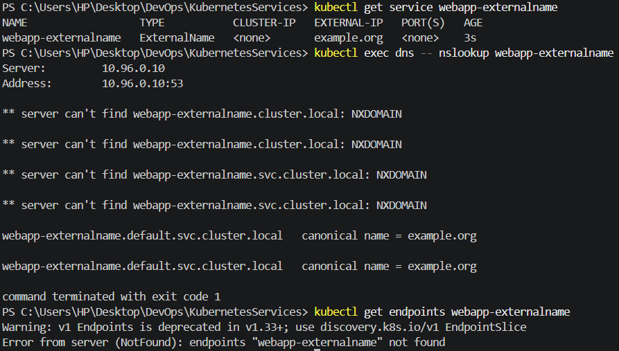

# ExternalName Service

## Objective

Create an ExternalName Service to map a Kubernetes Service name to an external DNS name.

## Configuration

| Field         | Value                 |
| ------------- | --------------------- |
| Service       | `webapp-externalname` |
| Type          | ExternalName          |
| External Name | `example.org`         |
| ClusterIP     | `<none>`              |
| Ports         | None                  |

## Verification

The Service was successfully created without a ClusterIP or Pod endpoints.

DNS lookup from the `dns` Pod showed:

```text id="w6xk9p"
webapp-externalname.default.svc.cluster.local
→ example.org
```

This demonstrates that an ExternalName Service provides a DNS alias to an external hostname rather than routing traffic to Kubernetes Pods.

No Endpoint or EndpointSlice was created for this Service.



## Service Manifest

The Service configuration is available in [`service.yaml`](service.yaml).
