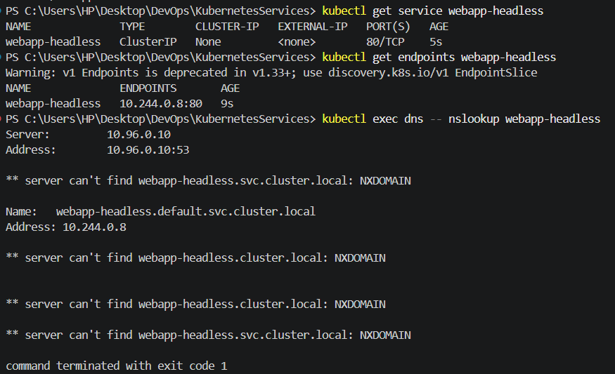

# Headless Service

## Objective

Create a Headless Service to provide direct Pod discovery through Kubernetes DNS without assigning a virtual ClusterIP.

## Configuration

| Field       | Value             |
| ----------- | ----------------- |
| Service     | `webapp-headless` |
| Type        | Headless          |
| ClusterIP   | `None`            |
| Port        | `80`              |
| Target Port | `http`            |
| Selector    | `app: webapp`     |
| Endpoint    | `10.244.0.8:80`   |

## Verification

The Service was successfully created with no ClusterIP.

DNS lookup from the `dns` Pod resolved:

```text
webapp-headless.default.svc.cluster.local
→ 10.244.0.8
```

This demonstrates that the Headless Service resolves directly to the `webapp` Pod IP instead of providing a virtual Service IP.



## Service Manifest

The Service configuration is available in [`service.yaml`](service.yaml).
