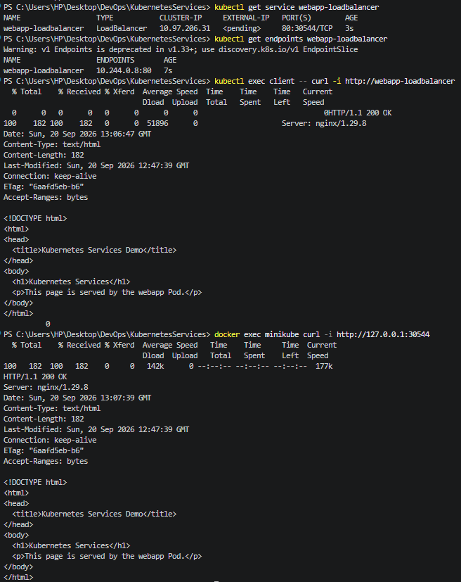

# LoadBalancer Service

## Objective

Create a LoadBalancer Service and observe how it behaves in a local Minikube environment.

## Configuration

| Field        | Value                 |
| ------------ | --------------------- |
| Service      | `webapp-loadbalancer` |
| Type         | LoadBalancer          |
| Service Port | `80`                  |
| NodePort     | `30544`               |
| Target Port  | `http`                |
| Selector     | `app: webapp`         |
| ClusterIP    | `10.97.206.31`        |
| External IP  | `<pending>`           |
| Endpoint     | `10.244.0.8:80`       |

## Verification

The Service successfully routed traffic to the `webapp` Pod.

* A request from the `client` Pod returned **HTTP 200**.
* The allocated NodePort `30544` was also tested from the Minikube node and returned **HTTP 200**.
* The External IP remained `<pending>` because the assignment was run on a local Minikube cluster rather than a cloud environment.

## Service Manifest

The Service configuration is available in [`service.yaml`](service.yaml).
