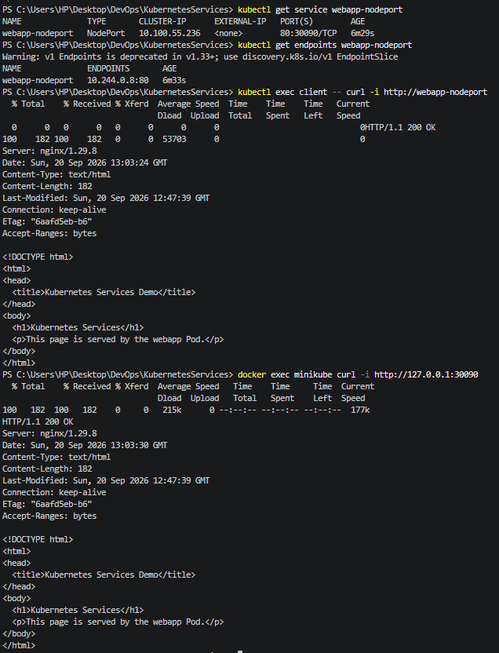

# NodePort Service

## Objective

Create a NodePort Service to expose the `webapp` Pod through a port on the Minikube node.

## Configuration

| Field        | Value             |
| ------------ | ----------------- |
| Service      | `webapp-nodeport` |
| Type         | NodePort          |
| Service Port | `80`              |
| NodePort     | `30090`           |
| Target Port  | `http`            |
| Selector     | `app: webapp`     |
| ClusterIP    | `10.100.55.236`   |
| Endpoint     | `10.244.0.8:80`   |

## Verification

The Service successfully routed traffic to the `webapp` Pod.

* A request from the `client` Pod returned **HTTP 200**.
* A request to NodePort `30090` from the Minikube node also returned **HTTP 200**.

The Windows host could not directly reach `192.168.49.2:30090` because of the Docker Desktop/WSL2 networking environment.

## Service Manifest

The Service configuration is available in [`service.yaml`](service.yaml).
