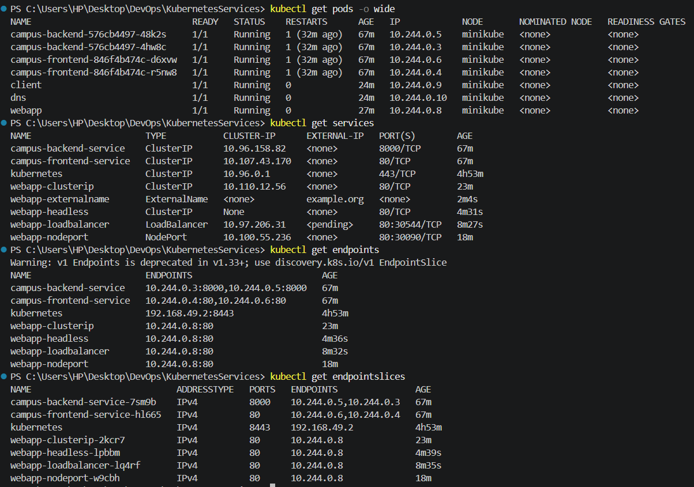

# Kubernetes Services

## Objective

Demonstrate and compare different Kubernetes Service types and how they provide access to a Pod.

Services covered:

* ClusterIP
* NodePort
* LoadBalancer
* Headless
* ExternalName

## Environment

| Component         | Details          |
| ----------------- | ---------------- |
| OS                | Windows 11 Home  |
| Minikube          | 1.39.0           |
| Kubernetes        | v1.37.0          |
| Driver            | Docker           |
| Container Runtime | containerd 2.2.1 |
| Node              | minikube         |
| Node IP           | 192.168.49.2     |

## Webapp

A simple Nginx `webapp` Pod was created using `nginx:1.29-alpine`.

The Pod is labelled `app: webapp` and serves an HTML page provided through a ConfigMap.

## Service Types

| Service      | Purpose                                     |
| ------------ | ------------------------------------------- |
| ClusterIP    | Provides internal cluster access            |
| NodePort     | Exposes the Service through a node port     |
| LoadBalancer | Requests external load-balancer access      |
| Headless     | Provides direct Pod discovery through DNS   |
| ExternalName | Maps a Service name to an external DNS name |

Detailed configuration and verification for each Service are documented in their respective folders.

## Final Result

All five Service types were created and verified successfully against the `webapp` Pod.



## Project Structure

```text
KubernetesServices/
├── README.md
├── webapp-pod.yaml
├── ClusterIP/
│   ├── service.yaml
│   └── README.md
├── NodePort/
│   ├── service.yaml
│   └── README.md
├── LoadBalancer/
│   ├── service.yaml
│   └── README.md
├── Headless/
│   ├── service.yaml
│   └── README.md
├── ExternalName/
│   ├── service.yaml
│   └── README.md
└── screenshots/
```

## Cleanup

After completing the assignment, the temporary Services and test Pods can be removed with:

```powershell
kubectl delete -f .\ClusterIP\service.yaml
kubectl delete -f .\NodePort\service.yaml
kubectl delete -f .\LoadBalancer\service.yaml
kubectl delete -f .\Headless\service.yaml
kubectl delete -f .\ExternalName\service.yaml

kubectl delete pod client dns
kubectl delete -f .\webapp-pod.yaml
```

The manifests and screenshots are retained in the repository for submission.
