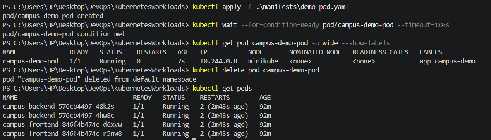
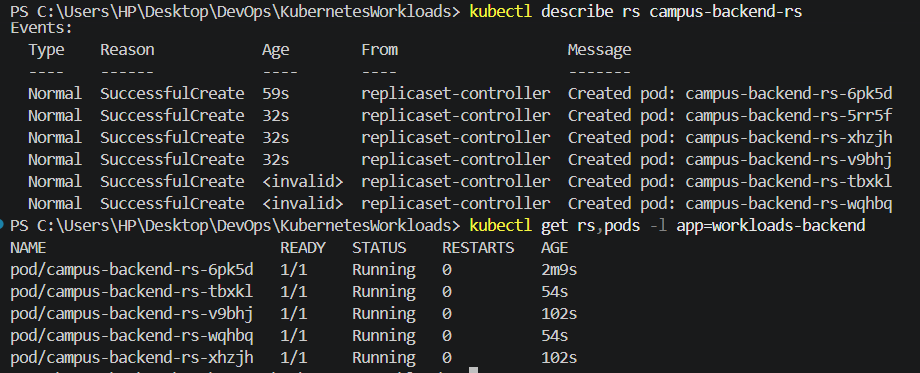
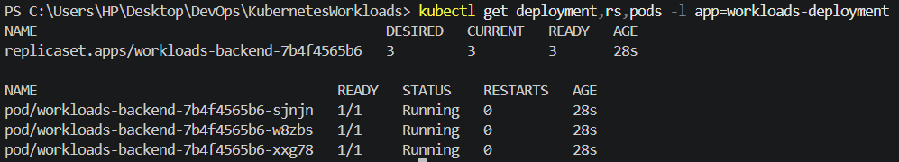
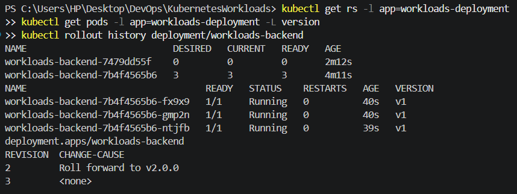
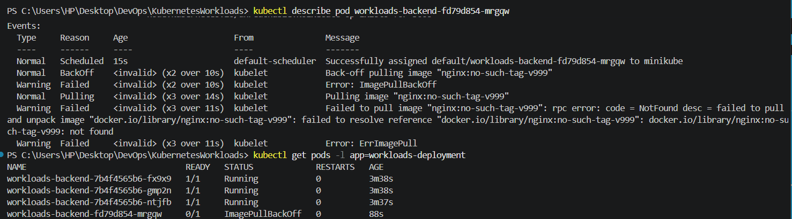
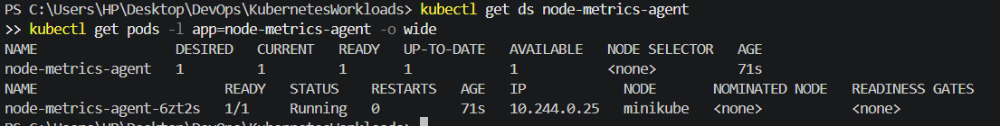

# Kubernetes Workloads

This assignment demonstrates **Pods, ReplicaSets, Deployments, and DaemonSets** using a local Minikube cluster.

## Environment

* Kubernetes: `v1.37.0`
* Minikube: `v1.39.0`
* Driver: Docker
* Node: `minikube`

## 1. Pod

A bare Pod is the smallest deployable Kubernetes unit. It is not managed by a controller, so deleting it does not recreate it.

Manifest: `manifests/demo-pod.yaml`

```powershell
kubectl apply -f .\manifests\demo-pod.yaml
kubectl wait --for=condition=Ready pod/campus-demo-pod --timeout=180s
kubectl get pod campus-demo-pod -o wide --show-labels
kubectl delete pod campus-demo-pod
kubectl get pods
```

The Pod reached `Running` state and remained deleted after removal.

**Screenshot:**



---

## 2. ReplicaSet

A ReplicaSet maintains a desired number of matching Pods and replaces Pods when they are deleted.

Manifest: `manifests/backend-rs.yaml`

The ReplicaSet was created with **3 replicas**.

```powershell
kubectl apply -f .\manifests\backend-rs.yaml
kubectl get rs,pods -l app=workloads-backend
```

After deleting one Pod, the ReplicaSet automatically created a replacement.

It was then scaled from **3 → 5 replicas**:

```powershell
kubectl scale rs campus-backend-rs --replicas=5
kubectl get rs,pods -l app=workloads-backend
```

Final state: **5 desired, 5 current, 5 running**.

**Screenshot:**



---

## 3. Deployment

A Deployment manages ReplicaSets and supports **rolling updates, revision history, and rollback**.

Manifests:

* `manifests/deployment-v1.yaml`
* `manifests/deployment-v2.yaml`

The v1 Deployment created **3 running Pods**.

```powershell
kubectl apply -f .\manifests\deployment-v1.yaml
kubectl rollout status deployment/workloads-backend --timeout=300s
```

### Rolling Update

v2 changed the Pod version from `v1` to `v2`.

```powershell
kubectl apply -f .\manifests\deployment-v2.yaml
kubectl rollout status deployment/workloads-backend --timeout=300s
kubectl get rs -l app=workloads-deployment
kubectl get pods -l app=workloads-deployment -L version
```

A new ReplicaSet was created and the Pods were updated to `v2`.

### Rollback

```powershell
kubectl rollout undo deployment/workloads-backend
kubectl rollout status deployment/workloads-backend --timeout=300s
kubectl get pods -l app=workloads-deployment -L version
```

The Deployment returned to **3 running v1 Pods**.

**Screenshots:**





---

## 4. Failed Image and Recovery

A non-existent image was intentionally configured:

```powershell
kubectl set image deployment/workloads-backend backend=nginx:no-such-tag-v999
kubectl get pods -l app=workloads-deployment
```

The new Pod entered `ErrImagePull` and `ImagePullBackOff`, while the existing v1 Pods remained running.

The failure was confirmed using:

```powershell
kubectl describe pod workloads-backend-fd79d854-mrgqw
```

The Deployment was then rolled back successfully:

```powershell
kubectl rollout undo deployment/workloads-backend
kubectl rollout status deployment/workloads-backend --timeout=300s
```

Final state: **3 v1 Pods running**.

**Screenshot:**



---

## 5. DaemonSet

A DaemonSet ensures that a Pod runs on each eligible node.

Manifest: `manifests/node-agent-ds.yaml`

```powershell
kubectl apply -f .\manifests\node-agent-ds.yaml
kubectl rollout status ds/node-metrics-agent --timeout=240s
kubectl get ds node-metrics-agent
kubectl get pods -l app=node-metrics-agent -o wide
```

The Minikube cluster has **one node**, so the DaemonSet created **one running Pod**.

Node verification:

```powershell
kubectl describe node minikube
```

The node reported:

```text
Taints: <none>
Unschedulable: false
```

**Screenshot:**




---

## Key Takeaways

* **Pod:** basic workload; no self-healing controller.
* **ReplicaSet:** maintains Pod count and provides self-healing/scaling.
* **Deployment:** manages ReplicaSets and supports rolling updates and rollback.
* **Failed image:** demonstrates `ErrImagePull` and `ImagePullBackOff`.
* **DaemonSet:** maintains one Pod per eligible node.
